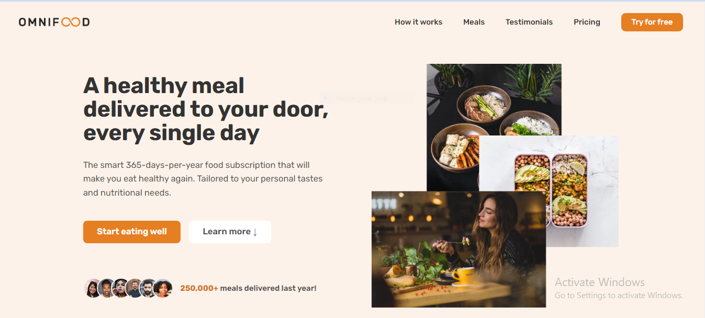

# OmniFood

Welcome to the Omni-Food project repository! This is a responsive food delivery landing page created using HTML and CSS. The purpose of this project is to showcase my front-end web development skills and provide an example of a visually appealing and interactive website.

### Visit the website here [Omnifood](https://omnifood-mz.vercel.app/).

## Preview

## Features

- **Responsive Design:** The website is designed to provide a seamless user experience on various devices, ensuring that it looks great on desktops, tablets, and mobile phones.

- **Interactive Elements:** From the navigation bar to the call-to-action buttons, the website incorporates CSS animations and hover effects to engage users.

- **Sleek Styling:** The layout, color scheme, and typography have been carefully chosen to create a modern and appetizing visual experience.

## Technologies Used

- HTML
- CSS
- JS

## Notes

- Icons in this project are provided by [Ionicons](https://ionic.io/ionicons).

_This project is a part of udemy course taught by Jonas Schmedtmann for educational purposes and does not represent an actual food delivery service._
